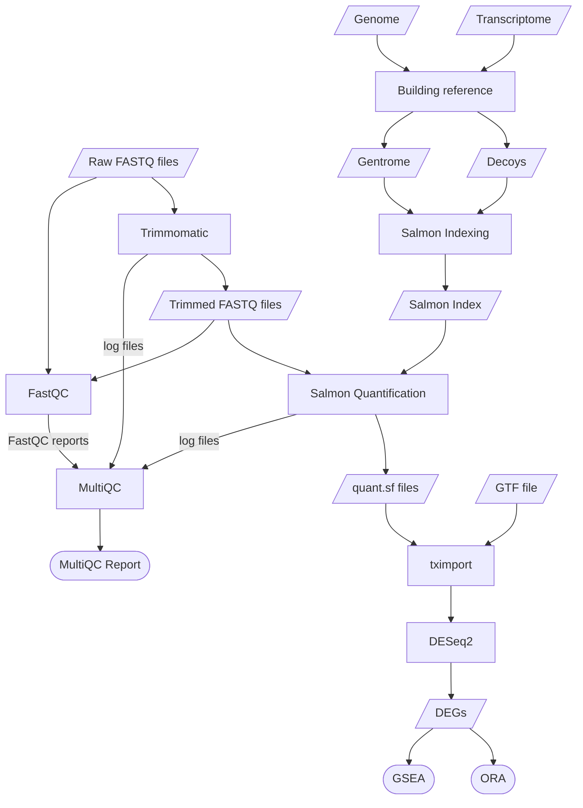

# Bulk RNA Sequencing Analysis Pipeline
This repository is designed to analyse Bulk RNA Sequencing data from *Rattus norvegicus* samples for the [Filippi Lab](https://www.filippilab.com/), as part of an MRes project. The goals of this workflow are:

- To identify differentially expressed genes (DEGs) across different conditions.

- To perform functional enrichment analysis through Overrepresentation Analysis (ORA) and Gene Set Enrichment Analysis (GSEA).

-  To visualise the results of differential expression analysis with the following plots:
    - PCAs.
    - Top variable genes heatmaps.
    - Sample-to-sample distance heatmaps.
    - Heatmaps displaying a custom set of genes.
    - Volcano plots.
    - MA plots.
    - A bar chart version of the plot generated by the `plotCounts()` function from *DESeq2*.
    - Pathview plots.


## Workflow

1. Raw FASTQ files are assessed using FastQC.
2. Adapters are trimmed with Trimmomatic.
3. The trimmed FASTQ files are re-assessed with FastQC.
4. Reference files from NCBI are used to generate the gentrome and decoy files.
5. The gentrome and decoy files are used to generate a Salmon index.
6. Trimmed FASTQ files are quantified with Salmon.
7. All log files and FastQC Reports are aggregated in a MultiQC report.
8. Transcript files are imported with *tximport*.
9. Differential expression analysis is conducted with *DESeq2*.
10. Enriched pathways are identified through GSEA and ORA.


# Requirements
All analyses were  performed on a Windows PC, except for Salmon, which required a HPC.


## Software
- FastQC[^1]
- Miniconda for Linux
- MultiQC [^2]
- R [^3]
- RStudio (recommended IDE for R scripts)
- Salmon [^4]
- Trimmomatic [^5]
- Ubuntu (via Windows Subsystem for Linux) 


## R Packages
| Package source | Packages |
|------------------------|------------------------|
| **CRAN** | *BiocManager [^6], dplyr [^7], ggplot2 [^8], readxl [^9], sessioninfo [^10], writexl [^11]* |
| **Bioconductor** | *apeglm [^12], clusterProfiler [^13], ComplexHeatmap [^14], DESeq2 [^15], EnhancedVolcano [^16], org.Rn.eg.db [^17], pathview [^18], RNAseqQC [^19], Rtracklayer [^20], SummarizedExperiment [^21], tximport [^22], vsn [^23]* |


## Files
The following reference files were obtained from the Rat Genome Assembly GRCr8 within the NCBI database [^24]:

| File                                 | Description   |
|--------------------------------------|---------------|
| GCF_036323735.1_GRCr8_rna.fna.gz     | Transcriptome |
| GCF_036323735.1_GRCr8_genomic.fna.gz | Genome        |
| GCF_036323735.1_GRCr8_genomic.gtf.gz | GTF file      |

Adapter sequences used by the Trimmomatic `ILLUMINACLIP` function were sourced from the [Trimmomatic adapters directory](https://github.com/timflutre/trimmomatic/tree/master/adapters) on GitHub.


# Installation
To install FastQC, MultiQC, and Trimmomatic as command-line tools:

```bash
conda env create -f environment.yml
conda activate rna_seq_analysis
```
R packages can be installed by running the `r_environment.R` script.


# Configuration
## `config.sh`
`config.sh` is a script which defines key file paths in bash scripts:

- `proj_dir_win` specifies the file path of the project root directory on Windows.
- `proj_dir_wsl` specifies the file path of the project root directory on Linux.
- `adapter_file` specifies the file path of the reference adapter file used in Trimmomatic.

These variables must be configured before running the pipeline.


## Project folder structure
Once `config.sh` is configured, the rest of the required project structure on Windows and Linux can be generated by running `00_setup.sh`.


### Windows:
```
config/      # Configuration files
├── config.sh
├── custom_gene_list.txt
├── multiqc.yaml            # MultiQC config file
├── adapters.fa
└── sample_table.xlsx
data/
├── raw/
│   ├── fastq/             # Raw FASTQ reads
│   ├── fastqc_reports/    # QC reports of raw reads
│   └── reference/         # Files from NCBI Genome
├── processed/
│   ├── trimmed_fastqc_reports/    # QC reports of trimmed reads
│   ├── trimmed_fastq/             # Trimmed FASTQ reads
│   ├── salmon_index/              # Salmon index, Gentrome, Decoys
│   └── salmon_quant/              # Quantified transcripts
├── rds/         # Saved R objects for downstream analysis
└── pathview/
results/
├── figures/        # Main plots
│   └── multifactor/
│   └── singlefactor/
├── multiqc/        # MultiQC report
├── qc_plots/
│   └── multifactor/
│   └── singlefactor/
├── sessioninfo/    # R session info
└── tables/
│   └── deg/
│   └── gsea/
│   └── ora/
scripts/
```


#### `config/`
- **The adapter sequences file is placed in `config/`**
- `custom_gene_list.txt` is a file that contains a custom list of gene symbols. The one provided by this repository is a list of genes involved in [Type II diabetes mellitus](https://www.kegg.jp/entry/rno04930).
- `sample_table.xlsx` is an Excel table containing the metadata of the samples.
- `multiqc.yml` contains the configuration settings for MultiQC.


#### `data/`
- `raw/` contains immutable raw data that should never be altered.
  - **Raw FASTQ.GZ files are placed in `raw/fastq/`.**
  - **The reference genome, transcriptome, and GTF file are placed in `raw/reference/`.**
- `processed/` contains intermediate files generated by the pipeline.


#### `results/`
- `multifactor/` and `singlefactor/` differentiates the results from the different design formula used.


#### `scripts/`
- This folder contains all the scripts directly involved with the analysis. They are numbered in sequence to indicate the order in which they should be run.


### Linux:
```
rna_seq_anaysis/
├── raw_fastq
├── trimmed_fastq
└── fastqc_report
```
FASTQ files are copied into the linux directory by the scripts to speed up the operations of FastQC and Trimmomatic.


# Usage
| Script | Description |
|------------------------|------------------------|
|`01_fastqc.sh`|Runs FastQC on FASTQ files, producing HTML and ZIP reports for each sample. To run the script, you will need to specify an argument indicating whether you want to analyse `raw` or `trimmed` FASTQ files.|
|`02_trimmomatic.sh`|Uses Trimmomatic to trim adapters from raw FASTQ files. Produces trimmed FASTQ files and log files.|
|`03_reference_prep.sh`|Generates gentrome and decoy files required for Salmon indexing using the reference FASTA files.|
|`04_salmon_index.sh`|Builds an index from the gentrome and decoy files for Salmon quantification.|
|`05_salmon_quant.sh`|Quantifies transcripts using Salmon with trimmed FASTQ files. The main output is a `quant.sf` file for each sample.|
|`06_multiqc.sh`|Aggregates QC reports from FastQC, Salmon, and Trimmomatic into a single HTML file using MultiQC.|
|`07_tximport.R`|Imports quantified transcripts into R using *tximport*. |
|`08_deseq2_multifactor.R`|Performs differential gene expression analysis using a multifactor design formula (`~ genotype * treatment)` and saves results to Excel.|
|`08_deseq2_singlefactor.R`|Performs differential gene expression analysis using a single-factor design formula (`~ condition`) and saves results to Excel.|
|`09_pca_plot.R`|Generates a PCA plot using *DESeq2*.|
|`10_heatmaps.R`|Generates an unscaled heatmap, a Z-score scaled heatmap, and a sample-to-sample distance heatmap using *ComplexHeatmap*.|
|`11_custom_heatmaps.R`|Generates a heatmap listing a custom set of genes based on `custom_gene_list.txt` using *ComplexHeatmap*.|
|`12_volcano_plot.R`|Generates a volcano plot using *EnhancedVolcano*. Labels either show the top differentially expressed genes or the list of genes based on `custom_gene_list.txt`.|
|`13_ma_plot.R`|Generates an MA plot using *ggplot2*.|
|`14_single_gene_plot.R`|Generates a bar chart version of the plot created by the `plotCounts()` function from *DESeq2* by using *ggplot2*.|
|`15_ora.R`|Performs ORA analysis using *clusterProfiler* and saves results to Excel.|
|`16_gsea.R`|Performs GSEA analysis using *clusterProfiler* and saves results to Excel.|
|`17_pathview_plot.R`|Generates a pathview plot using *pathview*.|
|`deseq2_utils.R`|Provides utility functions for the *DESeq2* scripts.|
|`plotting_utils.R`|Provides utility functions for plotting.|


[^1]: Andrews S. Babraham Bioinformatics - FastQC A Quality Control tool for High Throughput Sequence Data [Internet]. 2010 [cited 2025 Oct 7]. Available from: https://www.bioinformatics.babraham.ac.uk/projects/fastqc/

[^2]: Ewels P, Magnusson M, Lundin S, Käller M. MultiQC: Summarize analysis results for multiple tools and samples in a single report. Bioinformatics. 2016 Oct; 32(19):3047–8.

[^3]: R Core Team. R: A Language and Environment for Statistical Computing [Internet]. Vienna, Austria: R Foundation for Statistical Computing; 2025. Available from: https://www.R-project.org/

[^4]: Patro R, Duggal G, Love MI, Irizarry RA, Kingsford C. Salmon provides fast and bias-aware quantification of transcript expression. Nat Methods. 2017 Apr; 14(4):417–9.

[^5]: Bolger AM, Lohse M, Usadel B. Trimmomatic: A flexible trimmer for Illumina sequence data. Bioinformatics. 2014 Aug; 30(15):2114–20.

[^6]: Morgan M, Ramos M. BiocManager: Access the Bioconductor Project Package Repository [Internet]. 2025. Available from: https://CRAN.R-project.org/package=BiocManager

[^7]: Wickham H, François R, Henry L, Müller K, Vaughan D. Dplyr: A Grammar of Data Manipulation [Internet]. 2023. Available from: https://CRAN.R-project.org/package=dplyr

[^8]: Wickham H. ggplot2: Elegant Graphics for Data Analysis [Internet]. Springer-Verlag New York; 2016. Available from: https://ggplot2.tidyverse.org

[^9]: Wickham H, Bryan J. Readxl: Read Excel Files [Internet]. 2025. Available from: https://CRAN.R-project.org/package=readxl

[^10]: Wickham H, Chang W, Flight R, Müller K, Hester J. Sessioninfo: R Session Information [Internet]. 2025. Available from: https://CRAN.R-project.org/package=sessioninfo

[^11]: Ooms J. Writexl: Export Data Frames to Excel ’xlsx’ Format [Internet]. 2025. Available from: https://CRAN.R-project.org/package=writexl

[^12]: Zhu A, Ibrahim JG, Love MI. Heavy-tailed prior distributions for sequence count data: Removing the noise and preserving large differences. Bioinformatics. 2019 Jun; 35(12):2084–92.

[^13]: Xu S, Hu E, Cai Y, Xie Z, Luo X, Zhan L, et al. Using clusterProfiler to characterize multiomics data. Nat Protoc. 2024 Nov; 19(11):3292–320.

[^14]: Gu Z, Eils R, Schlesner M. Complex heatmaps reveal patterns and correlations in multidimensional genomic data. Bioinformatics. 2016 Sep; 32(18):2847–9.

[^15]: Love MI, Huber W, Anders S. Moderated estimation of fold change and dispersion for RNA-seq data with DESeq2. Genome Biol. 2014 Dec; 15(12):1–21.

[^16]: Blighe K, Rana S, Lewis M. EnhancedVolcano: Publication-ready volcano plots with enhanced colouring and labeling [Internet]. 2025. Available from: https://bioconductor.org/packages/EnhancedVolcano

[^17]: Carlson M. Org.Rn.eg.db: Genome wide annotation for Rat. 2025. 

[^18]: Luo W, Brouwer C. Pathview: An R/Bioconductor package for pathway-based data integration and visualization. Bioinformatics. 2013 Jul; 29(14):1830–1.

[^19]: Ziebell F. RNAseqQC: Quality Control for RNA-Seq Data [Internet]. 2024. Available from: https://CRAN.R-project.org/package=RNAseqQC

[^20]: Lawrence M, Gentleman R, Carey V. Rtracklayer: An R package for interfacing with genome browsers. Bioinformatics. 2009 Jul; 25(14):1841–2

[^21]: Morgan M, Obenchain V, Hester J, Pagès H. SummarizedExperiment: A container (S4 class) for matrix-like assays [Internet]. 2025. Available from: https://bioconductor.org/packages/SummarizedExperiment

[^22]: Soneson C, Love MI, Robinson MD. Differential analyses for RNA-seq: Transcript-level estimates improve gene-level inferences. F1000Res. 2016 Feb; 4:1521.

[^23]: Huber W, Heydebreck A von, Sültmann H, Poustka A, Vingron M. Variance stabilization applied to microarray data calibration and to the quantification of differential expression. Bioinformatics. 2002 Jul; 18(suppl_1):S96–104.

[^24]: Goldfarb T, Kodali VK, Pujar S, Brover V, Robbertse B, Farrell CM, et al. NCBI RefSeq: Reference sequence standards through 25 years of curation and annotation. Nucleic Acids Res. 2024 Nov; 53(D1):D243–57.
